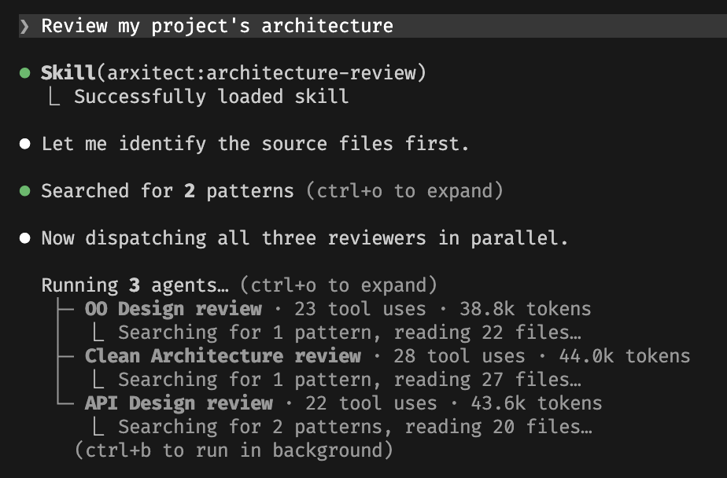

# Arxitect

[](https://github.com/andonimichael/arxitect/actions/workflows/ci.yml)

Arxitect is an agentic coding plugin that enforces best-practice software design & architecture. It adds implementation agents and architecture reviewers to your client that enforce API Design, Object-Oriented Design, and Clean Architecture standards.

<p align="center">
  
</p>


## Background

Arxitect was influenced by the design of [Superpowers](https://github.com/obra/superpowers). Arxitect extends Superpower's concept of improving agents at implementing coding tasks to improving agents at broader code architecture and software design.

Modern coding agents are getting exceptionally good at implementing a given coding task. And with validation-in-the-loop, you can be reasonably confident they will implement a correct solution. However, their implementation often doesn't adhere to the decades of software design best-practices that the community has established and is often myopic to broader software quality attributes including maintainability and extensibility. To make things worse, this low code quality compounds as coding agents implement additional tasks.

Software design principles weren't established specifically to help humans. They were designed to make code easier to refactor, modify, extend, test, and maintain. They proactively mitigate the risk of bugs. They reduce the surface area for changes. They minimize the amount of information needed to grok the code. All of these are just as important for agents. They reduce the amount of context needed to understand the code and make changes. They reduce the chance of bugs and improve testing efficacy. And they make agents more effective at implementing feature requests.

## How it works

When you ask your coding agent to implement something, Arxitect provides sub-agents and skills that can implement the change or review the result against established design principles. Three specialized reviewers examine your code from different angles:

- An **API Design Reviewer** assesses naming conventions, method signatures, parameter design, type safety, and REST endpoint design.
- An **Object Oriented Design Reviewer** checks SOLID principles, DRY violations, composition vs. inheritance choices, and design pattern applicability.
- A **Clean Architecture Reviewer** evaluates component cohesion (REP, CRP, CCP), component coupling (ADP, SDP, SAP), and quality attributes like maintainability and testability.

## What it contains

Arxitect contains the following agents:
  - `@architect` that will plan and implement your change using best practices.
  - `@architecture-review` that will review your code for adherence to best practices.

And it contains the following skills:
  - `/architect` that will plan and implement your change using best practices.
  - `/architecture-review` that will review your code for adherence to best practices.
  - `/api-design-review` that will audit your code for adherence to api design principles.
  - `/oo-design-review` that will audit your code for adherence to object oriented design principles.
  - `/clean-architecture-review` that will audit your code for adherence to clean architecture principles.
  - `/using-arxitect` the bootstrap skill that teaches your client how and when to use Arxitect

## Installation

### Claude Code (via Plugin Marketplace)

In Claude Code, register the marketplace first:

```bash
/plugin marketplace add andonimichael/arxitect
```

Then install the plugin:

```bash
/plugin install arxitect@arxitect-marketplace
```

Finally reload your plugins to pick up Arxitect in the current session:

```bash
/reload-plugins
```

> **Tip:** To automatically [keep plugins up-to-date](https://code.claude.com/docs/en/discover-plugins#configure-auto-updates), open `/plugin`, go to **Marketplaces**, select `arxitect`, and choose **Enable auto-update**. Claude Code will automatically refresh the marketplace and plugins at startup.

### Cursor

Clone the repository into Cursor's local plugin directory:

```bash
git clone https://github.com/andonimichael/arxitect.git ~/.cursor/plugins/local/arxitect
```

Then restart Cursor or run **Developer: Reload Window**.

### Codex

Clone the repository into Codex:

```
git clone https://github.com/andonimichael/arxitect.git ~/.codex/arxitect
```

Then symlink the skills into Codex's agent skills directory:

```
ln -s ~/.codex/arxitect/skills ~/.agents/skills/arxitect
```

Finally, restart Codex to pick up the new skills.

### Gemini CLI

```bash
gemini extensions install https://github.com/andonimichael/arxitect
```

### Verify Installation

Ask your client about Arxitect or ask your agent to review your code's architecture. It should automatically invoke the relevant Arxitect skill.
